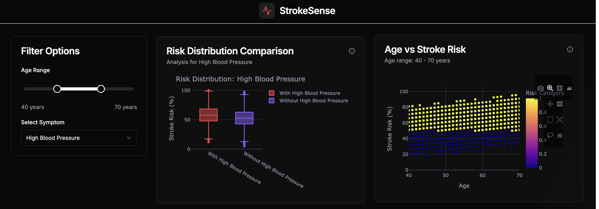
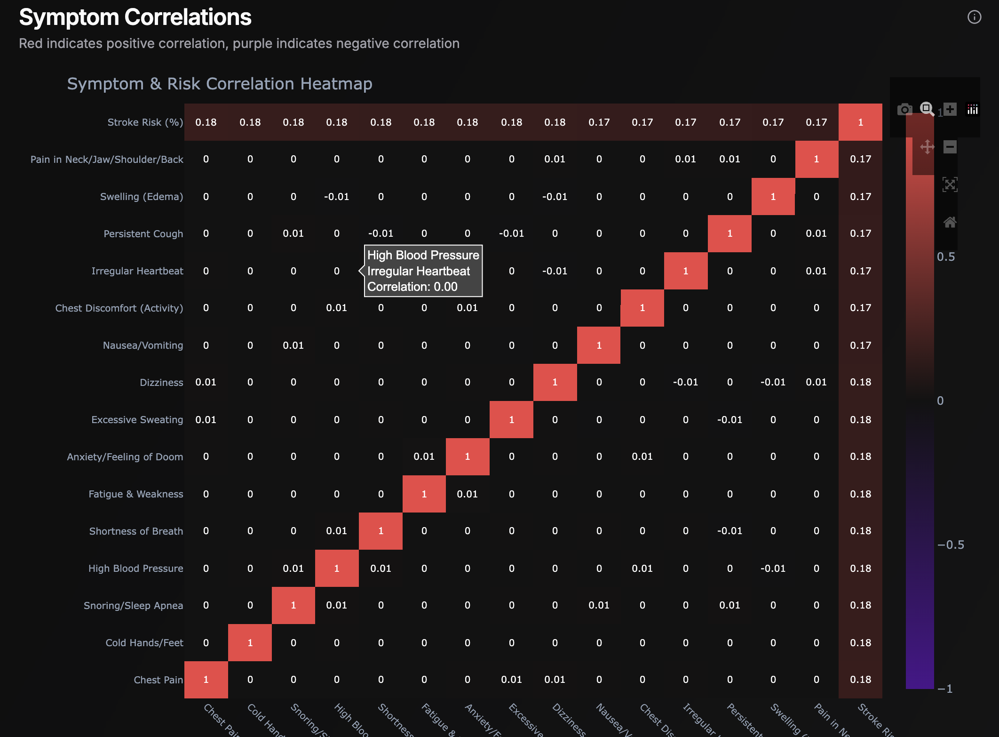
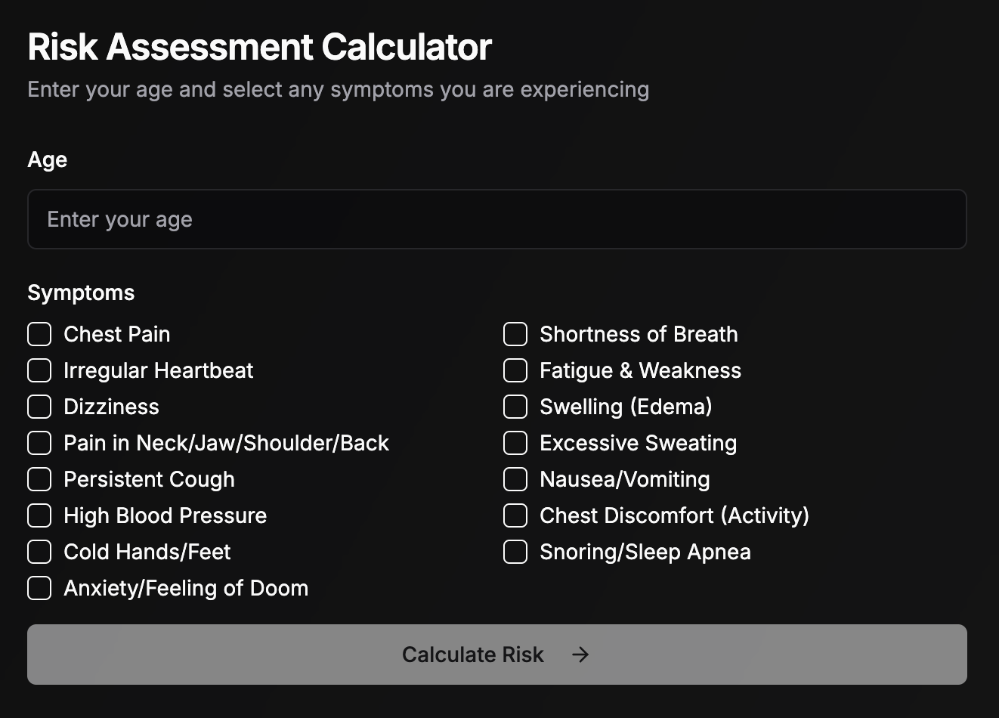

# StrokeSense

StrokeSense is a data visualization dashboard that helps analyze the correlation between stroke symptoms and stroke risk. It provides interactive charts and a predictive model to assess stroke risk based on user input.

## Table of Contents
- [Inspiration](#inspiration)
- [Features](#features)
- [How It Works](#how-it-works)
- [Technology Stack](#technology-stack)
- [Setup and Installation](#setup-and-installation)
- [Usage](#usage)
- [Screenshots](#screenshots)
- [Challenges Faced](#challenges-faced)
- [Future Improvements](#future-improvements)
- [Contributors](#contributors)
- [License](#license)

## Inspiration
Stroke is a leading cause of death and disability worldwide. Early detection of stroke risk can save lives, and we wanted to create a data-driven solution that helps visualize and predict stroke risk based on symptoms and age.

## Features
- **Interactive Heatmap:** Shows the correlation between symptoms and stroke risk.
- **Boxplots:** Compare the risk of stroke for users with vs. without symptoms.
- **Scatter Plot:** Displays the distribution of stroke risk across different ages.
- **Line Plot:** Shows symptom distribution by risk category.
- **Predictive Model:** Accepts user input (age and symptoms) to predict stroke risk as either high or low.

## How It Works
1. **Data Collection:** We use a dataset containing stroke risk factors and symptoms.
2. **Data Processing:** The dataset is cleaned and preprocessed using Python.
3. **Machine Learning Model:** A RandomForestClassifier is trained to predict stroke risk based on user-provided symptoms and age.
4. **Visualization Dashboard:** Built using React and Plotly for intuitive data exploration.
5. **API Backend:** FastAPI serves predictions and provides data for visualizations.

## Technology Stack
- **Frontend:** React, Plotly
- **Backend:** FastAPI, Python, Pandas, NumPy, Scikit-learn
- **Machine Learning:** RandomForestClassifier
- **Data Visualization:** Plotly, Seaborn
- **Hosting:** Local development (future deployment to cloud services)

## Setup and Installation

### Prerequisites
- Python 3.8+
- Node.js and npm

### Backend Setup
1. Clone the repository:
   ```sh
   git clone https://github.com/yourusername/strokesense.git
   cd strokesense/backend
   ```
2. Create a virtual environment:
   ```sh
   python -m venv venv
   source venv/bin/activate  # For Windows use `venv\Scripts\activate`
   ```
3. Install dependencies:
   ```sh
   pip install -r requirements.txt
   ```
4. Run the FastAPI server:
   ```sh
   uvicorn app:app --reload
   ```

### Frontend Setup
1. Navigate to the frontend directory:
   ```sh
   cd ../frontend
   ```
2. Install dependencies:
   ```sh
   npm install
   ```
3. Start the React development server:
   ```sh
   npm start
   ```

## Usage
- Visit `http://localhost:3000` to access the StrokeSense dashboard.
- Enter age and symptoms to receive a stroke risk prediction.
- Explore the interactive visualizations to understand risk factors better.

## Screenshots

### Dashboard Home


### Heatmap Visualization


### Prediction Interface


## Challenges Faced
- Finding a reliable dataset covering diverse stroke-related symptoms.
- Optimizing model performance while ensuring fast API response times.
- Designing an intuitive and informative dashboard layout.
- Ensuring seamless integration between React and FastAPI.

## Future Improvements
- **Enhanced Model:** Incorporate additional factors like lifestyle, diet, and medical history.
- **Improved UI:** Add more interactivity and better user feedback.
- **Deployment:** Host the project on a cloud platform for wider accessibility.
- **Collaboration:** Work with healthcare professionals to refine the model and insights.

## Contributors
- **Shivam Singh** - Lead Developer
- **Ishan Jain** - Developer

## License
This project is licensed under the MIT License - see the [LICENSE](LICENSE) file for details.

